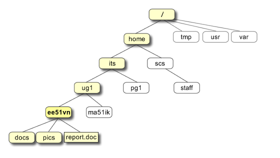

## Introduction to Computing {data-timing="30"}

### From biological questions to repeatable analyses

**Computing Bootcamp**

Today: why compute, why Linux/\*nix, and what happens in a terminal.

**No programming experience assumed.**

::: notes
Time: 00:00-00:30 (30 seconds).

This is an orientation, not a command memorisation test. By the end, students
should be able to explain why a saved analysis is useful, distinguish a terminal
from a shell, and interpret a few simple commands. Tell students they can watch
the demonstration; there is no need to keep up by typing.
:::

## Start with a biological question {data-timing="90"}

**Does plant diversity differ between woodland and grassland?**

- You have observations from several sites.
- The files contain inconsistent names and missing measurements.
- Next week, another 100 sites arrive.

**How would you repeat the analysis and explain every step?**

::: notes
Time: 00:30-02:00 (90 seconds).

Invite one brief suggestion, then connect it to the motivation for computing:
biological data are often messy, and computation connects data with questions
and models. Small datasets need care too; this is not only about big data.

Distinguish processing from inference. Before comparing diversity we would need
to consider sampling effort, site independence, missing data and the meaning of
our diversity measure. A computer cannot decide these scientific issues for us.
The little dataset in today's demo counts observations, not species diversity.
:::

## A program is an explicit recipe {data-timing="90"}

**Data → instructions → results → scientific judgement**

1. Read the observations.
2. Check names, units and missing values.
3. Calculate a summary and draw a figure.
4. Check whether the result makes biological sense.

Save the instructions: **inspect, correct, rerun, share.**

::: notes
Time: 02:00-03:30 (90 seconds).

Define a program as instructions a computer can carry out. An algorithm is the
step-by-step method; code expresses it in a language the computer can run.
Neither term implies something mysterious or necessarily complicated.

Contrast repeating undocumented clicks with rerunning saved instructions. GUIs
are useful too, and some record workflows. The scientific goal is a transparent
record, not avoiding the mouse. Reproducibility also needs the input data,
software versions and settings; saving code alone is not enough. An incorrect
recipe can reproduce an incorrect result perfectly.
:::

## What is doing the work? {data-timing="75"}

| Part | Job |
|:--|:--|
| **Processor (CPU)** | Carries out instructions |
| **Memory (RAM)** | Holds the data and work currently in use |
| **Storage** | Keeps saved files after a program closes |
| **Operating system (OS)** | Manages hardware, files and running programs |

Linux and macOS are operating systems; R and Python are programming languages.

::: notes
Time: 03:30-04:45 (75 seconds).

Use a desk analogy briefly: working space is RAM and the filing cabinet is
storage. Saving a file is different from keeping a value in a running program.
Closing a session may lose unsaved work. Large datasets can exhaust memory even
when there is plenty of disk space.

Strictly, Linux is the kernel, the central part of an OS. A Linux distribution
such as Ubuntu packages that kernel with tools and applications. In everyday
conversation we call the complete system Linux. No hardware details are needed
for the demo.
:::

## Terminal, shell, command: three different things {data-timing="75"}

- **Terminal:** the application where you type and see text.
- **Shell:** the program interpreting your commands, such as Bash or Zsh.
- **Command:** an instruction to run a tool or a shell operation.

```text
you type a command → the shell acts → output appears
```

The terminal is another way to use your computer, alongside windows and menus.

::: notes
Time: 04:45-06:00 (75 seconds).

Open a terminal briefly, or point to one before switching back to the slides.
On Linux, launch Terminal from the applications menu; on macOS, use Spotlight
to find Terminal. A terminal within VS Code works too.

Bash is common on Linux; modern macOS normally starts Zsh. Today's commands
work in both. A terminal is not itself Bash, Python, or R. If you start Python
or R inside it, the language accepting your input changes. This distinction
helps explain why a shell command typed at a Python prompt fails.
:::

## Why Linux/\*nix?! First, the names {data-timing="60"}

- **Unix:** an influential operating-system family with decades of history.
- **Unix-like (\*nix):** systems sharing many Unix ideas and interfaces.
- **Linux:** a Unix-like system; **Ubuntu** is one Linux distribution.
- **macOS:** has Unix foundations and many familiar command-line tools.

**Different systems, many transferable skills.**

::: notes
Time: 06:00-07:00 (60 seconds).

Say "star-nix" or "Unix-like" aloud. Here \*nix is an informal umbrella term,
not a command students should type. Do not imply Linux is a copy of the Unix
source code, that macOS is Linux, or that all Unix systems are open-source.

Students already have the intended environments for this lecture: Linux or macOS.
We are explaining the choice, not asking them to install an OS during a lecture.
:::

## Why Linux/\*nix?! The scientific payoff {.smaller data-timing="120"}

| Capability | Why it helps a biologist |
|:--|:--|
| Plain-text data and scripts | Inspect how observations become results |
| Small tools that connect | Filter data, then pass it to another tool |
| Saved commands and scripts | Rerun a workflow when new sites arrive |
| Multiple users and jobs | Share a server while simulations run |
| Network and remote access | Work on a computing cluster from your laptop |
| Scientific tools and help | Find software, documentation and examples |

**Learn locally; reuse the skills on larger systems.**

**"No viruses"?** No: Linux and macOS can get malware. Install trusted software and keep it updated.

::: notes
Time: 07:00-09:00 (120 seconds).

Make each row concrete. A plain-text CSV or script can be inspected with an
editor; not all biological data are plain text, and readable files alone do not
guarantee reproducibility. Filter observations with grep, then count matching
lines with wc on the later demo slide: this is the chapter's small-tools-and-pipes
idea in miniature. A saved script can repeat the same check when new sites arrive.
On a shared server, different researchers can log in and run separate jobs; a
simulation can run while someone else checks results. Access that server over
the network from a laptop. A cluster is a group of computers used for jobs too
large or slow for a laptop, not a faster laptop. Point students to documentation
and community examples when a new tool is needed.

Linux is widely used on research servers and high-performance computing systems.
Many Linux distributions and scientific tools are freely available and
open-source, supporting access and inspection. macOS itself is not wholly
open-source. Multi-user access, multitasking and networking are not exclusive to
Unix-like systems; their practical combination with shell tools is why these
skills transfer well to research infrastructure. Good science is possible on
other operating systems too.

The Unix chapter mentions few viruses, but "no viruses" is a myth: Linux and
macOS can be targeted by malware, including malicious downloads and scripts.
Use trusted sources, updates and backups. Unix-like systems are not immune to
software bugs or accidental deletion. Linux and macOS tools sometimes have different options;
we will use a small shared subset today. Reproducibility is a practice, not an
automatic property of an operating system.
:::

## Files have addresses {data-timing="90"}

A **directory** is a folder. A **path** tells the computer where to look.

:::: columns
::: {.column width="56%"}

```text
project/
  code/       saved analysis instructions
  data/       input observations
  results/    generated tables and figures
```

- `data/survey.csv`: relative to your **current directory**.
- `/`: the filesystem root; `~`: your home directory; `..`: the parent.
- Use consistent names and exact capitalisation.

:::
::: {.column width="44%"}

{width="100%"}

<small>Directory tree: [Pathan Ruet](https://pathanruet.files.wordpress.com/2012/05/unix-tree.png)</small>

:::
::::

::: notes
Time: 09:00-10:30 (90 seconds).

Connect to MQB's code/data/results convention. Explain that csv means
comma-separated values, a common plain-text table format. The example directory
tree is schematic, not something to paste into a terminal.

An absolute path starts at /; a relative path starts wherever you currently are.
A home directory is commonly /home/name on Linux and /Users/name on macOS;
~ is a convenient shell shortcut. Use a file-manager analogy: you are looking
inside one folder at a time. Moving with cd changes that location, not the files.

Linux filesystems are usually case-sensitive; common macOS installations use
case-insensitive filesystems, though this is configurable. Do not describe all
macOS commands as case-insensitive. Exact spelling makes work portable.
:::

## Read a command from left to right {data-timing="60"}

```bash
head -n 4 data/computing-demo.csv
```

| Piece | Meaning |
|:--|:--|
| `head` | Show the beginning of a file |
| `-n 4` | An option: show four lines |
| `data/computing-demo.csv` | The file to read |

A prompt such as `$` or `%` is **not part of the command**.

::: notes
Time: 10:30-11:30 (60 seconds).

Define an option as a setting that changes a command's behaviour, and an argument
as information supplied to the command. Spaces separate the pieces. Here the
four lines include the header. The option -n works for head on Linux and macOS.

The teaching folder for the next slide has been opened in advance. Explain that
these code blocks are displayed examples, not code executed by the slide deck.
:::

## Two-minute terminal demo {data-timing="120"}

**Question: how many observation rows are labelled woodland?**

```bash
pwd
ls
head -n 4 data/computing-demo.csv
grep '^woodland,' data/computing-demo.csv
```

`pwd`: where am I? · `ls`: what is here? · `grep`: which lines match?

**These commands inspect data; they do not change it.**

::: notes
Time: 11:30-13:30 (120 seconds).

Before teaching, open a terminal in content/lectures/intro_computing within your MQB
checkout. Enlarge the terminal font. Check that data/computing-demo.csv exists.
Do not spend lecture time navigating from an unknown starting directory.

0:00-0:25: run pwd and ls. Relate the printed location to the relative path.
0:25-1:00: run head. Identify the header habitat,site,species and the three
displayed observations. This is synthetic teaching data, not field evidence.
1:00-1:45: ask students to predict what filtering for woodland will show,
then run grep. It returns three rows, including two observations at site w1.
Explain only that ^ means the start of a line, followed by the exact label and
comma. The quotes keep the search pattern together; regex lessons come later.
1:45-2:00: ask whether three rows means three sites or three species. Neither:
we counted observations. Different questions require different instructions.

Fallback if the terminal is unavailable: head shows the header and the rows
woodland,w1,oak; grassland,g1,clover; woodland,w1,fern. grep shows
woodland,w1,oak; woodland,w1,fern; woodland,w2,oak. Read these out or use
the next slide's expected count. The demo needs no internet or installation.
:::

## Small tools can work together {data-timing="60"}

```bash
grep '^woodland,' data/computing-demo.csv | wc -l
```

**Matching rows → pipe `|` → line counter**

Expected count: **3 observation rows**.

Not three sites. Not three species. Not a test of habitat differences.

::: notes
Time: 13:30-14:30 (60 seconds).

Run the combined command, or show it on the slide. A pipe sends one command's
output to another command's input. wc -l counts newline characters; each record
in this small file occupies one newline-terminated line. The header is excluded
because it does not begin with woodland followed by a comma. Whitespace around
the printed count can differ across systems.

This works for our deliberately simple table, whose habitat is the first field.
It is not a general CSV parser: quoted fields can contain commas or newlines.
Use appropriate data-reading tools in R or Python for real structured analyses.
The lesson is composition of tools, not treating every research dataset as lines.
:::

## Why learn more than one language? {data-timing="90"}

| Tool | A useful role in our workflow |
|:--|:--|
| **Shell / Bash** | Organise files and connect programs |
| **R** | Analyse data, fit models and visualise results |
| **Python** | Process data, simulate systems and build tools |
| **Git** | Record changes to code and collaborate |

**Choose for the question and the team, not a language rivalry.**

::: notes
Time: 14:30-16:00 (90 seconds).

Return to the biological question. Shell commands help organise inputs; R or
Python can read a table properly, check it, fit a model and plot results. Their
capabilities overlap substantially. Git is a version-control tool, not another
programming language, and does not replace backups.

An editor such as VS Code is where we write and save instructions. A script is
a text file of code, for example analysis.R, analysis.py or checks.sh. A notebook
can mix explanations, code and results, but execution order still matters.
Students do not need to learn all these tools today. This is the map for the
coming practicals, following the multilingual philosophy in MQB's introduction.
:::

## Habits that protect your science {data-timing="90"}

:::: {.columns}
::: {.column width="60%"}
- Keep raw data unchanged; save code and results separately.
- Test on a small example; check the output.
- Record steps, software versions and assumptions.
- Keep backups; inspect unfamiliar commands before running them.
:::
::: {.column width="40%"}
{width="300" fig-alt="xkcd comic illustrating how an undocumented workflow can depend on surprising software behaviour."}

<small>[xkcd: Workflow](https://xkcd.com/1172/) · Randall Munroe · [CC BY-NC 2.5](https://creativecommons.org/licenses/by-nc/2.5/)</small>
:::
::::

::: notes
Time: 16:00-17:30 (90 seconds).

The comic is optional illustration: the important point is making dependencies
explicit so another person, including your future self, can repeat the work.

Mention that rm normally bypasses the desktop Trash and that > can overwrite
a file. Neither is needed today. Never add sudo just because a command failed;
it grants elevated privileges. Check web or AI suggestions against documentation
and a small, safe example. Never upload confidential data to a public help tool.

Errors are information, not evidence you cannot compute. Read the message,
check your current directory and spelling, and ask for help with the command,
the error and what you expected. Tab completion and command history will help
in the practical, but there is no need to memorise a command catalogue.
:::

## Check your understanding {data-timing="60"}

1. Why save instructions instead of relying on memory?
2. What does `data/computing-demo.csv` depend on?
3. Does a result of `3` prove woodland has greater diversity?

**The computer follows instructions. You remain responsible for the science.**

::: notes
Time: 17:30-18:30 (60 seconds).

Allow a few seconds for each answer. Expected answers: saved instructions can
be inspected and rerun; the relative path depends on the current directory;
no, three is only a count of selected observation rows, not a diversity estimate
or a statistical comparison. If time is short, ask students to answer silently
and supply the answers aloud. The extra minute on the final slide is a buffer
for one question, not a reason to rush these foundations.
:::

## Tasks for today {data-timing="90"}

Work through the [MQB Unix chapter](https://mulquabio.github.io/MQB/notebooks/unix.html). Start with its first two hands-on sections:

1. **Exploring files and directories:** try `ls`, `ls /`, `ls -a` and `ls -l`. Explain what changes.
2. **Building your coursework directory structure:** make a workspace with `week1/code`, `week1/data`, `week1/results` and `week1/sandbox`.

Use your own workspace name, not the chapter's example. **Questions?**

::: notes
Time: 18:30-20:00 (90 seconds: 30-second close plus 60 seconds for a question).

Close with three messages: computing makes scientific steps explicit; Unix-like
skills transfer between a laptop and research infrastructure; start small and
check results. Students should work through the Unix chapter, beginning with
"Exploring files and directories" and "Building your coursework directory
structure". These are the chapter's first hands-on sections, before its later
Bash command challenge and FASTA exercise. The chapter's sample coursework name
is course-specific; students should use their own workspace name and check
whether a folder already exists before creating it. No student software
installation is part of this lecture.

Source map for the instructor:
- ../../intro.md: learning goals, multilingual tools, code/data/results,
  understanding commands, choosing editors and finding help.
- ../../notebooks/unix.ipynb: Unix motivation, filesystem hierarchy, shell,
  navigation, command arguments, grep and pipes.

This lecture deliberately qualifies older generalisations in the Unix chapter:
macOS is not Linux or wholly open-source; terminal and shell are distinct;
case sensitivity depends on the filesystem; Unix-like systems are not immune
to malware; and scientific computing is not exclusive to Unix.
:::