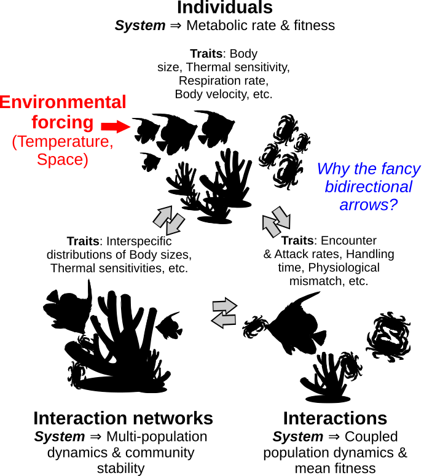
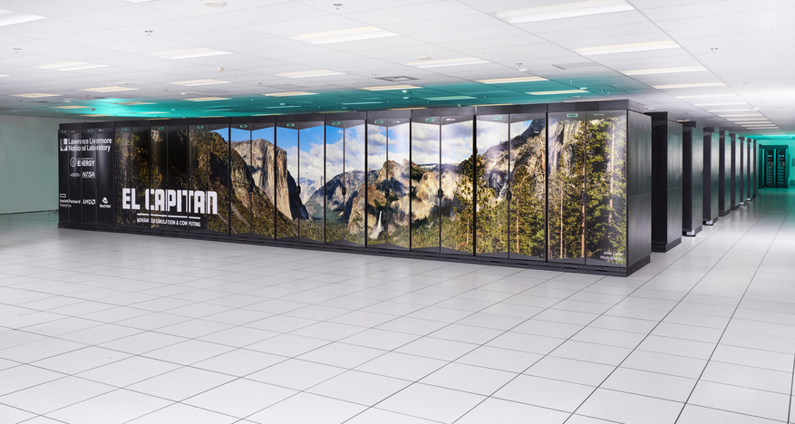
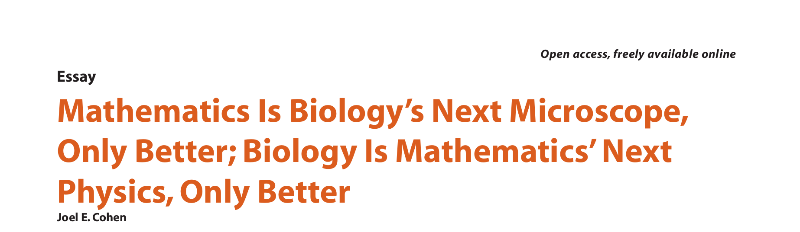
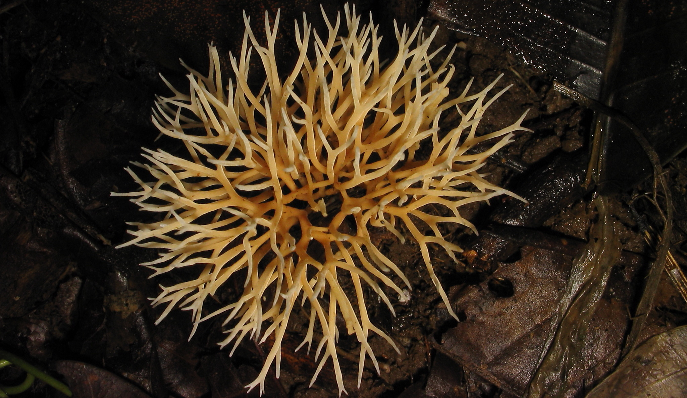

## Why ecology and evolution?

:::: columns
::: {.column width="53%"}

Ecology and evolution ask how living systems:

- change through time,
- interact across scales,
- respond to environmental change, and
- generate the diversity we observe.

These are scientific questions with direct consequences for people and ecosystems.

:::
::: {.column width="47%"}

{width="96%"}

<small>*Big Fish Eat Little Fish*, Pieter van der Heyden, 1557</small>

:::
::::

## Where computation matters

::: {.incremental}
- Sustainable agriculture and agro-ecology
- Disease emergence, transmission, and outbreak response
- Climate change, carbon balance, and nutrient cycling
- Conservation, species invasions, and ecosystem restoration
- Microbiomes and ecosystem engineering
- Population genetics, bioinformatics, and biodiversity monitoring
:::

**Different systems, shared challenge:** connect complex evidence to testable explanations.

## Ecological systems are dynamic

<iframe
  class="talk-video"
  src="https://www.youtube.com/embed/LwRTw_7NNJs?si=KUlZvRT6nn8JgFkg"
  data-external="1"
  title="Video illustrating ecological dynamics"
  loading="lazy"
  referrerpolicy="strict-origin-when-cross-origin"
  allow="accelerometer; autoplay; clipboard-write; encrypted-media; gyroscope; picture-in-picture; web-share"
  allowfullscreen>
</iframe>

<small>Network unavailable? Continue with the [video on YouTube](https://www.youtube.com/watch?v=LwRTw_7NNJs); the rest of the presentation works offline.</small>

## Why *computational* ecology and evolution?

:::: columns
::: {.column width="48%"}

{width="92%"}

:::
::: {.column width="52%"}

::: {.incremental}
- Biological systems are complex and often nonlinear.
- Mathematical ideas become more powerful when we can explore them numerically.
- Data can be large, heterogeneous, incomplete, and difficult to organise.
- Evidence often requires simulation, visualisation, and statistical analysis.
:::

:::
::::

## Complex systems resist intuition

Small changes can produce disproportionate outcomes when systems contain:

:::: columns
::: {.column width="50%"}

- feedbacks,
- thresholds,
- delays, and
- interactions among many components.

:::
::: {.column width="50%"}

Computation lets us:

- simulate competing explanations,
- explore parameter space,
- compare predictions with observations, and
- quantify uncertainty.

:::
::::

**A simulation is an experiment on a model, not a substitute for biological judgement.**

## Scale changes what is possible

:::: columns
::: {.column width="55%"}

{width="96%"}

<small>El Capitan, Lawrence Livermore National Laboratory</small>

:::
::: {.column width="45%"}

More computing power can support:

- larger simulations,
- more detailed models,
- repeated uncertainty analyses, and
- high-throughput data processing.

But **more computation does not rescue a weak question, biased data, or an unsuitable model.**

:::
::::

## Reproducibility connects theory and data

```text
biological question
        |
        v
model <--> data <--> analysis
        |
        v
evidence, interpretation, revision
```

A reproducible workflow records how each result was produced:

::: {.incremental}
- inputs and assumptions,
- code and software versions,
- checks, decisions, and uncertainty, and
- outputs that can be regenerated and reviewed.
:::

## What you will learn to do

By combining biological reasoning with quantitative methods, you can learn to:

::: {.incremental}
- choose methods that match a scientific question,
- organise, inspect, and visualise biological data,
- formulate and simulate mathematical and statistical models,
- fit models to data and interpret their limitations,
- use computational tools, including AI assistance, critically, and
- design analyses that collaborators can understand and rerun.
:::

**The goal is not software fluency alone; it is stronger scientific reasoning.**

## Biology has centuries of open problems

:::: columns
::: {.column width="62%"}

::: {.knuth-quote}
> *It is hard for me to say confidently that, after fifty more years of explosive growth of computer science, there will still be a lot of fascinating unsolved problems at peoples' fingertips ... Biology easily has 500 years of exciting problems to work on, it's at that level.*
>
> -- Donald Knuth
:::

[Cohen JE (2004), *Mathematics Is Biology's Next Microscope, Only Better; Biology Is Mathematics' Next Physics, Only Better*. *PLOS Biology* 2(12): e439.](https://doi.org/10.1371/journal.pbio.0020439)

:::
::: {.column width="38%"}

{width="100%"}

:::
::::

## A practical computational toolchain

| Tool | Role in a research workflow |
|:--|:--|
| **Linux or macOS** | A Unix-like environment for scientific tools |
| **Git** | A history of changes to code and text |
| **R and Python** | Data analysis, modelling, simulation, and visualisation |
| **VS Code** | Editing code, text, and project files |
| **SSH** | Secure access to remote computers and clusters |
| **LaTeX or Quarto** | Reproducible reports, papers, and presentations |

**Choose tools for the question and the collaboration, not for a language rivalry.**

## Prepare your environment

Before practical work, confirm that you can use:

:::: columns
::: {.column width="50%"}

- a supported [Linux](https://ubuntu.com/tutorials/install-ubuntu-desktop) or macOS environment,
- [Git](https://git-scm.com/book/en/v2/Getting-Started-Installing-Git), and
- [VS Code](https://code.visualstudio.com/docs/setup/setup-overview).

:::
::: {.column width="50%"}

- [SSH](https://www.openssh.com/) for remote access,
- [LaTeX](https://www.latex-project.org/get/) when a project requires it, and
- [Homebrew](https://brew.sh/) for optional macOS package management.

:::
::::

Course material: [MulQuaBio](https://mulquabio.github.io/MQB/intro.html)

**Back up important data before changing an operating system or development environment.**

## Habits that matter more than any tool

::: {.incremental}
1. Start from a precise biological question.
2. Keep raw data separate from generated results.
3. Save analysis steps as code and record important decisions.
4. Inspect intermediate outputs; do not trust a result only because it ran.
5. Use documentation, peers, and AI critically; verify suggestions against evidence.
6. Commit work regularly and maintain tested backups.
:::

**Be curious, be systematic, and learn collaboratively.**

## Questions?

{width="58%" fig-align="center"}
